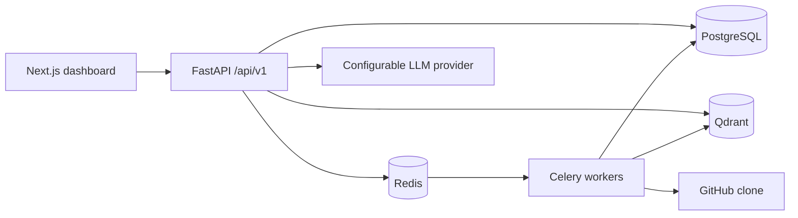
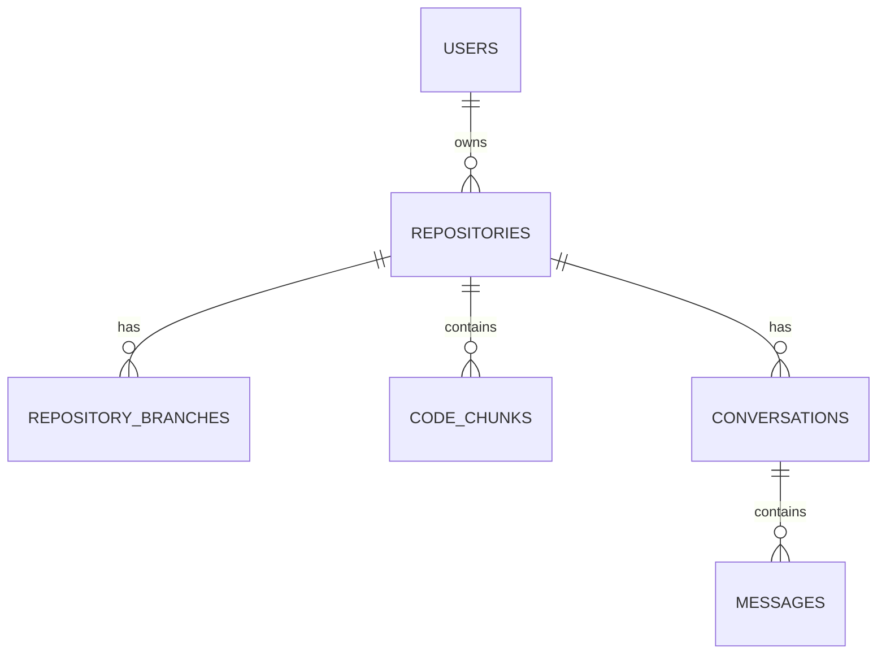

# Architecture

## Core data model

Code chunks retain repository, branch, path, language, symbol, imports, exports, commit hash, and line range. Qdrant payloads mirror filterable fields; PostgreSQL full-text search supports BM25-like keyword ranking.
