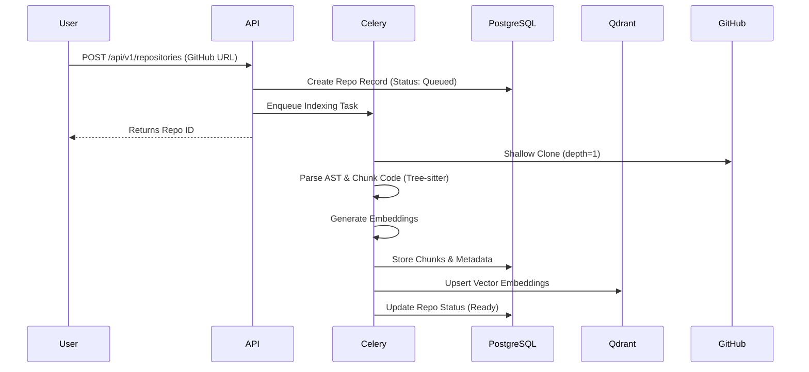
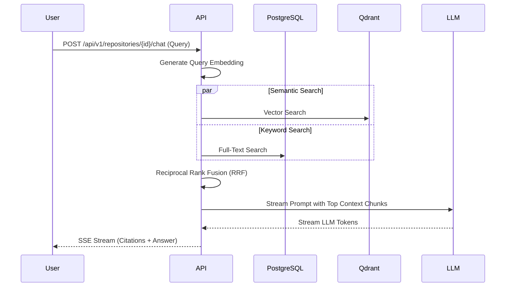

# ◈ RepoSage: Autonomous Repository Intelligence

> One-line pitch: RepoSage transforms static GitHub repositories into dynamic, queryable intelligence engines using hybrid RRF search and symbol-aware AST chunking.

[](https://your-demo-link.com) <!-- Replace with real demo link -->

 <!-- Replace with actual screenshot/GIF -->

---

## 🚀 Key Features

*   **Symbol-Aware AST Chunking:** Uses Tree-sitter to semantically parse codebases, extracting functions, classes, and imports for logical, context-rich chunks.
*   **Hybrid Search with RRF:** Combines Qdrant semantic vector search with PostgreSQL keyword search, fused via Reciprocal Rank Fusion for pinpoint accuracy.
*   **Real-time Streaming Answers:** Delivers LLM responses instantly via Server-Sent Events (SSE), complete with citations to exact file paths and line numbers.
*   **Offline Mode / Bring Your Own Model:** Operates with OpenAI, Gemini, Groq, DeepSeek, or local Ollama models. Includes a fallback offline Embedder if LLM keys are absent.
*   **Background Ingestion Engine:** Asynchronously clones and indexes public repositories using Celery and Redis without blocking the API.

---

## 🏗️ System Architecture

### Ingestion Flow


### Query Flow


---

## 🛠️ Technology Stack

| Category | Technology | Details |
| :--- | :--- | :--- |
| **Frontend** | Next.js 15, React 19, Zustand, Tailwind | Responsive SPA, SSE Streaming Client |
| **Backend** | FastAPI, Python 3.12 | REST API, Dependency Injection, Streaming |
| **Task Queue**| Celery, Redis | Async repository cloning & indexing |
| **Database** | PostgreSQL, SQLAlchemy 2 | Relational data, Keyword search |
| **Vector DB** | Qdrant | Fast, scalable semantic similarity search |
| **Parsing** | Tree-sitter | Multi-language AST parsing for code chunks|

---

## 📊 Evaluation Results

<!-- Placeholder for /eval results -->
| Metric | Result | Target |
| :--- | :--- | :--- |
| **Precision@K** | [Waiting for metrics] | > 85% |
| **Recall@K** | [Waiting for metrics] | > 90% |
| **Latency (P95)** | [Waiting for metrics] | < 500ms |

*(Note: Replace the above table with the real metrics from the `/eval` results)*

---

## ⚙️ Setup Instructions

### 🐳 Docker (Recommended)

1. **Environment Variables:**
   ```bash
   cp .env.example .env
   # Add your LLM keys (e.g., OPENAI_API_KEY) in the .env file.
   ```
2. **Launch Services:**
   ```bash
   docker compose up --build
   ```
3. **Access:**
   * Frontend: `http://localhost:3000`
   * Backend Docs: `http://localhost:8000/docs`

### 💻 Local Development

1. **Start Infrastructure:** Run PostgreSQL, Redis, and Qdrant locally. Update `.env` with their connection URIs.
2. **Backend:**
   ```bash
   cd backend
   pip install -r requirements.txt
   uvicorn app.main:app --reload --port 8000
   # In another terminal:
   celery -A app.worker.celery_app worker --loglevel=INFO
   ```
3. **Frontend:**
   ```bash
   cd frontend
   npm install
   npm run dev
   ```

---

## 🔌 API Overview

*   `POST /api/v1/auth/register` & `login`: JWT Authentication.
*   `POST /api/v1/repositories`: Ingest a new GitHub repository.
*   `GET /api/v1/repositories/{id}/search`: Perform an RRF hybrid search (returns JSON).
*   `POST /api/v1/repositories/{id}/chat`: Start an SSE streaming chat session with the codebase.

---

## 🧠 Design Decisions & Trade-offs

1. **Hybrid Search (RRF) over Pure Vector:** 
   * *Decision:* Combined keyword and vector search. 
   * *Trade-off:* Slightly higher latency and storage cost, but drastically improves precision for exact variable names or unique IDs which vector models often miss.
2. **AST Chunking over Line/Token Chunking:** 
   * *Decision:* Using Tree-sitter to chunk by semantic symbols (functions/classes). 
   * *Trade-off:* More complex ingestion pipeline, but prevents cutting functions in half, leading to significantly better LLM context comprehension.
3. **Celery for Async Ingestion:** 
   * *Decision:* Offloaded cloning and indexing to background workers.
   * *Trade-off:* Requires Redis dependency, but keeps the API highly responsive and prevents timeouts on massive repositories.

---

## 🚧 Limitations

*   **Shallow Clones:** Currently only supports `depth=1` clones to save space; historical commit queries are not possible.
*   **Public Repositories Only:** Cannot ingest private repositories requiring SSH/PAT authentication yet.
*   **Language Support:** Tree-sitter AST extraction is optimized for a subset of languages (Python, TS/JS, Go). Others fall back to generic chunking.

---

## 🔮 Future Work

*   **GitHub App Integration:** Support for private repository ingestion via OAuth and GitHub App webhooks.
*   **Automated PR Reviews:** Hook into GitHub Actions to automatically comment on PRs based on the codebase context.
*   **Graph RAG:** Upgrade from linear hybrid search to a Graph RAG approach using the extracted AST import/export relationships for multi-hop reasoning.
