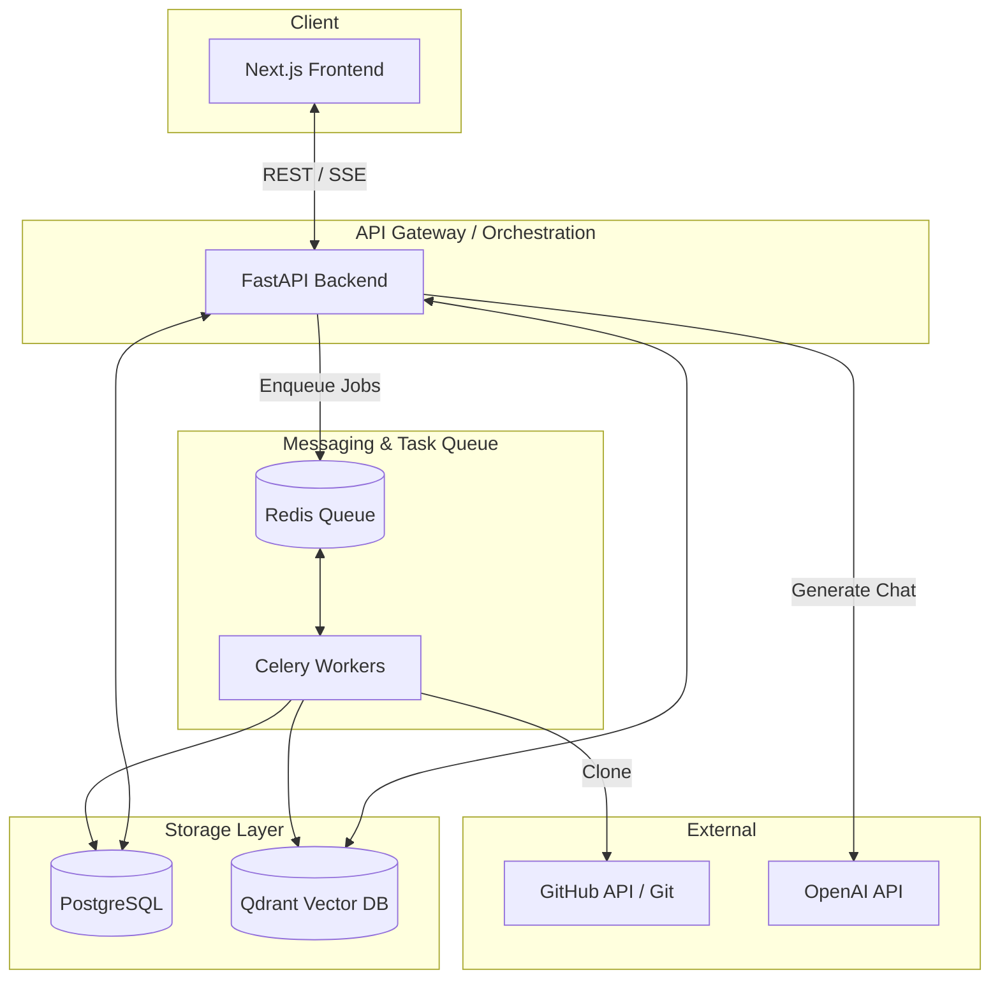

# ◈ RepoSage

RepoSage is an AI-powered GitHub repository intelligence platform. It ingests public repositories, analyzes and indexes source-aware code chunks using AST symbol classification, and leverages hybrid search with reciprocal-rank fusion (RRF) to provide accurate, cited technical answers to questions about the codebase.

---

## 🚀 Key Features

*   **Repository Ingestion:** Clones public GitHub repositories in the background using shallow clones (`depth=1`) via Celery.
*   **Symbol-Aware Chunking:** Parses codebases to extract symbols (functions, classes, etc.) and modules using regex-based AST extraction, segmenting files into logical chunks with line overlap.
*   **Hybrid Search engine:** Combines PostgreSQL full-text keyword retrieval (frequency overlap) with Qdrant semantic vector search.
*   **Reciprocal-Rank Fusion (RRF):** Fuses keyword search results and semantic search scores to rank code sections with superior precision.
*   **Source Citation & Line Referencing:** Traces and highlights exact file paths, line ranges, symbols, and languages in search and chat responses.
*   **Streaming Chat Answers:** Streams completions in real-time using a Server-Sent Events (SSE) protocol.
*   **Offline Fallback:** Features a stable, local hash-based bag-of-words embedding generator (`Embedder`) that allows the platform to function without external LLM keys.

---

## 🏗️ System Architecture



### Core Architecture Components

1.  **Frontend Dashboard:** A sleek Next.js (React 19) app built with TypeScript, TanStack React Query, Zustand for global state, and custom responsive styling.
2.  **FastAPI REST Server:** Serves HTTP API endpoints for authorization, repository registration, indexing status, database search, and streaming LLM chat.
3.  **Relational database (PostgreSQL):** Stores users, repo metadata, code-chunk relationships, imports, exports, and language distribution statistics.
4.  **Vector database (Qdrant):** Houses high-dimensional vector embeddings of the chunked code alongside filterable payloads (e.g. `repository_id`, `path`, `symbol_name`).
5.  **Task Processor (Celery & Redis):** Runs cloning, file traversal, and database indexing in asynchronous background processes.

---

## 🛠️ Technology Stack

| Component | Technology | Version / Details |
| :--- | :--- | :--- |
| **Frontend Framework** | [Next.js](https://nextjs.org/) / React | `15.2.2` / `^19.0.0` |
| **State & Fetching** | [Zustand](https://github.com/pmndrs/zustand) / [React Query](https://tanstack.com/query) | `^5.0.3` / `^5.66.9` |
| **Backend Framework** | [FastAPI](https://fastapi.tiangolo.com/) | `0.115.12` |
| **Task Queue** | [Celery](https://docs.celeryq.dev/) with [Redis](https://redis.io/) | Celery `5.4.0` / Redis `5.2.1` |
| **Vector DB** | [Qdrant](https://qdrant.tech/) | Client `1.13.2` / Docker `v1.13.4` |
| **Relational DB** | [PostgreSQL](https://www.postgresql.org/) / [SQLAlchemy](https://www.sqlalchemy.org/) | PostgreSQL 16 Alpine / SQLAlchemy `2.0.38` |
| **AST & Git Client** | [Tree-sitter](https://tree-sitter.github.io/tree-sitter/) / [GitPython](https://gitpython.readthedocs.io/) | tree-sitter `0.24.0` / GitPython `3.1.44` |
| **Security** | PyJWT / passlib / bcrypt | JWT auth, hashed credentials |

---

## 📂 Project Directory Structure

```text
├── backend/
│   ├── Dockerfile                  # Python container build configuration
│   ├── requirements.txt            # Python dependencies (FastAPI, Celery, SQLAlchemy, etc.)
│   ├── app/
│   │   ├── __init__.py
│   │   ├── core.py                 # Configuration settings (Pydantic Settings)
│   │   ├── db.py                   # SQLAlchemy engine and session dependency
│   │   ├── indexer.py              # Repository cloner, parser, database & Qdrant upserts
│   │   ├── main.py                 # FastAPI application, route declarations, lifespan hook
│   │   ├── models.py               # SQLAlchemy Database schemas (User, Repository, CodeChunk)
│   │   ├── schemas.py              # Pydantic schemas for request/response serialization
│   │   ├── security.py             # Cryptography helper functions (Bcrypt context, JWT generation)
│   │   ├── services.py             # AST parsing, local 64-dim Embedder, Qdrant client, Hybrid Search
│   │   └── worker.py               # Celery app initialization and task definition
│   └── tests/
│       └── test_api.py             # Pytest API test cases (health, authentication checks)
├── frontend/
│   ├── Dockerfile                  # Node frontend builder
│   ├── package.json                # Next.js, React, React-Query, Zustand dependencies
│   ├── tsconfig.json               # TypeScript config
│   ├── next.config.ts              # Next.js routing and config
│   └── app/
│       ├── layout.tsx              # Root HTML context provider
│       ├── page.tsx                # Single-page client dashboard (Auth & Chat UI)
│       └── styles.css              # Custom styling sheet (Aesthetic dark mode typography)
├── docs/
│   ├── architecture.md             # High-level architecture flowcharts and ERD
│   ├── deployment.md               # Production infrastructure and secret configuration rules
│   └── development.md              # Local non-docker flow guidelines
├── docker-compose.yml              # Standard orchestrator setup containing DBs, Cache, App, Worker
├── .env.example                    # Sample configuration variables template
└── README.md                       # Comprehensive project documentation
```

---

## 💾 Core Database Model

The platform uses a relational database schema for user management, indexing state tracking, and keyword filtering:

*   **Users (`users`):** Keeps credential hashes (`password_hash`), administration status (`is_admin`), and registration details.
*   **Repositories (`repositories`):** Saves the GitHub repository HTTP address, name, current git branch, indexing status (`queued`, `indexing`, `ready`, or `failed`), and stats JSON containing file language distribution and code chunk counts.
*   **CodeChunks (`code_chunks`):** Retains individual code blocks with metadata including path origin, target branch, AST extracted symbol names, symbol classification (`symbol` or `module`), start/end lines, imports array, exports array, commit hexsha, and embedding model versions.

---

## 🔌 API Endpoints

### 🔐 Authentication
*   `POST /api/v1/auth/register` - Registers a new user. Returns a JWT access token.
*   `POST /api/v1/auth/login` - Validates user credentials. Returns a JWT access token.
*   `GET /api/v1/auth/me` - Retrieves account profile details of the currently authenticated user.

### 📁 Repositories
*   `GET /api/v1/repositories` - Lists repositories registered under the active user.
*   `POST /api/v1/repositories` - Registers a public GitHub repository. Enqueues a Celery indexing task.
*   `GET /api/v1/repositories/{id}` - Returns the current indexing status and details of a repository.
*   `DELETE /api/v1/repositories/{id}` - Deletes a repository and associated indexed chunks.
*   `POST /api/v1/repositories/{id}/index` - Forces repository re-indexing (synchronous processing if Celery is offline).

### 🔍 Search & QA
*   `GET /api/v1/repositories/{id}/search?q={query}` - Returns the top `8` code snippets sorted by reciprocal-rank fusion.
*   `POST /api/v1/repositories/{id}/chat` - Sends a query and returns a Server-Sent Events stream containing cited source lines and the assistant reply.

---

## ⚙️ Quick Start

### Prerequisites
*   [Docker](https://www.docker.com/) and [Docker Compose](https://docs.docker.com/compose/)

### Running with Docker Compose
1.  **Configure Environment Variables:**
    Copy the sample environment configuration:
    ```bash
    cp .env.example .env
    ```
    Set your `OPENAI_API_KEY` (if utilizing OpenAI models for advanced chat; falls back gracefully to deterministic local search if empty).

2.  **Start Services:**
    Build and launch the containers:
    ```bash
    docker compose up --build
    ```

3.  **Access the Applications:**
    *   **Frontend Dashboard:** `http://localhost:3000`
    *   **Backend OpenAPI / Swagger Docs:** `http://localhost:8000/docs`

---

## 🔧 Local Development Setup

If you prefer to run the applications locally without Docker:

### 1. Backend Setup
1.  Ensure you have **Python 3.12** installed.
2.  Install dependencies:
    ```bash
    cd backend
    pip install -r requirements.txt
    ```
3.  Ensure local instances of PostgreSQL, Redis, and Qdrant are running and set their connection URIs in your `.env` file.
4.  Run the API server:
    ```bash
    uvicorn app.main:app --reload --port 8000
    ```
5.  Start the Celery worker (in a separate terminal):
    ```bash
    celery -A app.worker.celery_app worker --loglevel=INFO
    ```

### 2. Frontend Setup
1.  Ensure you have **Node.js 20+** installed.
2.  Install packages:
    ```bash
    cd frontend
    npm install
    ```
3.  Run the Next.js development server:
    ```bash
    npm run dev
    ```

### 🧪 Running Tests
Execute unit and API integration tests in the backend folder:
```bash
cd backend
pytest
```
